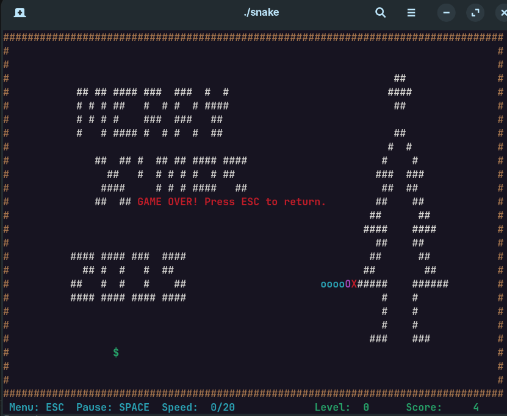

# Snake Game

Classic console snake (Vietnamese UI). Eat `$` to grow; avoid walls, obstacles, and your body.

**Demo:** [YouTube](https://youtu.be/MGb5rRRL5Yg)



The project keeps beginner-friendly code by separating game state from platform-specific console code.

## Requirements

| Platform | Dependency |
|----------|------------|
| Linux / macOS | [ncurses](https://invisible-island.net/ncurses/) — e.g. `sudo apt install libncurses-dev` |
| Windows | None (Win32 console APIs) |
| All | CMake >= 3.14, C++11 compiler |

## Build & run

```bash
cmake -B build -S . && cmake --build build
```

| Platform | Binary |
|----------|--------|
| Linux / macOS | `./build/snake` |
| Windows (MSVC) | `build\Release\snake.exe` or `build\Debug\snake.exe` |

Build output under `build/` is ignored by `.gitignore`.

## Controls

| Action | Key |
|--------|-----|
| Start moving | Arrow keys |
| Change direction | Arrow keys |
| Pause / resume | `Space` |
| Back / quit | `Esc` |
| Menu navigate | `Up` / `Down`, then `Enter` |
| Difficulty | `Left` / `Right`, then `Esc` |

## Notes

- Uses ASCII draw characters only, so rendering is consistent across platforms.
- Linux/macOS uses `ncurses` with `set_escdelay(25)` for faster `Esc` response.
- Rendering is buffered: `ConWriteXY(...)` writes to the screen buffer, `ConFlush()` shows the frame.
- The snake body is redrawn every tick for more stable display.

## Architecture

```text
Snake.cpp            UI: menu, drawing, input, screens
game.h / game.cpp    Pure game logic (no console code)
map_data.h           Level layout data
console.h            Cross-platform console API
console_win32.cpp    Windows backend
console_ncurses.cpp  Linux / macOS backend
```

## Files

| File | Role |
|------|------|
| `Snake.cpp` | UI, menu, render loop, keyboard handling |
| `game.h` / `game.cpp` | Snake movement, collision, prey spawn, score, speed |
| `map_data.h` | Simple editable level rows |
| `console.h` | Shared console API: draw, input, flush |
| `console_win32.cpp` | Win32 implementation |
| `console_ncurses.cpp` | ncurses implementation |
| `CMakeLists.txt` | Build setup |
| `.gitignore` | Ignore build output, binaries, and IDE files |

## Game API

```cpp
Game g;
game_init(g);               // or game_init(g, current_speed)
game_set_dir(g, DIR_RIGHT);
StepResult r = game_step(g);
```

| Function | Purpose |
|----------|---------|
| `game_init` | Reset map, snake, prey, score; optionally keep speed |
| `game_set_dir` | Change direction, but block 180-degree reverse |
| `game_step` | Run one simulation tick |
| `game_speed_up` / `game_speed_down` | Change difficulty |
| `game_speed_level` | Convert speed to slider level `0..20` |
